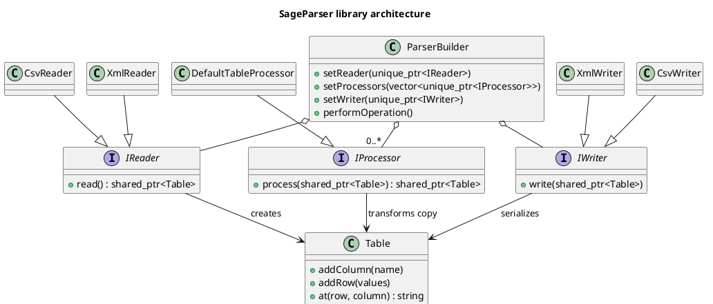

# SageParser

SageParser is a small C++20 library for moving string-valued tabular data
between CSV, XML, and an in-memory `Table`. A `ParserBuilder` can combine a
reader, one or more processors, and a writer into a conversion pipeline.

Current format support:

- CSV: header-based reading and writing, configurable delimiter, escaped
  quotes, and quoted multiline fields.
- XML: direct children of the document root are rows; their child elements are
  fields. The writer emits `<Root><Row>...</Row></Root>`.

XLSX and JSON are not implemented. The library performs no type inference, so
all cell values remain strings. XML output requires at least one row and ASCII
column names valid as XML element names. `DefaultTableProcessor` is
domain-specific: it normalizes known inventory columns and removes unknown
ones. The Qt UI sources are experimental and excluded from the default build.

## Build and test

Requirements: CMake 3.23+, Conan 2, and a C++20 compiler.

```sh
conan profile detect --force  # needed once per Conan installation
conan install . --output-folder=build/conan --build=missing \
  -s build_type=Release -s compiler.cppstd=20
cmake -S . -B build \
  -DCMAKE_TOOLCHAIN_FILE=build/conan/conan_toolchain.cmake \
  -DCMAKE_BUILD_TYPE=Release -DBUILD_TESTING=ON
cmake --build build
ctest --test-dir build --output-on-failure
```

Conan supplies [rapidcsv](https://github.com/d99kris/rapidcsv),
[pugixml](https://github.com/zeux/pugixml), and GoogleTest for the test build.

## Design



The editable diagram source is [PlantUML](docs/Library_Design.puml).

Licensed under the [GNU General Public License v3.0](LICENSE).
